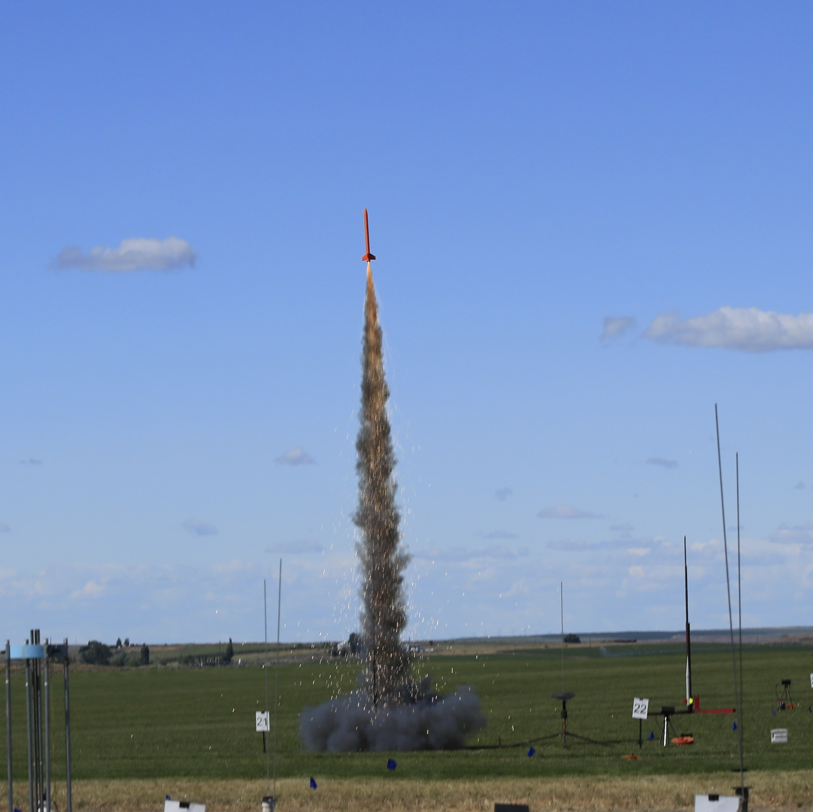

# 3D Printed Rockets
The goal of this project is to collaborate on designs of rockets and rocket components for 3D printing.

The first set of designs were developed in [OpenSCAD](https://www.openscad.org/). Using OpenSCAD requires some basic programming skills and it is helpful to have some knowledge of basic math and trigonometry. That said, it is easier to work with existing designs, make tweaks and assemble them into new rockets without knowing any math.

People are encourged to join and add designs they made with other tools. As we learn more togther we will figure out the best tools to use for different projects and skills. 

We want rocket designs to be safe and sound and to follow standard rocket design rules. So we also encourgae contributors to provide documentation about how parts were stress tested and OpenRocket model/simulation results as well as real field test results.

You will find common parts under the 'parts' folder and the first rocket design in this project under 'Janus'. Feel free to add new designs or new parts you have been devloping. Make sure to add a header to your files with you name to get propper attribution. 

To join this project please create an [issue](https://github.com/3dp-rocket/rockets/issues) and type access request in the description. 

Janus - HM115 DM - Tri-Cities - Swoosh - 2019
