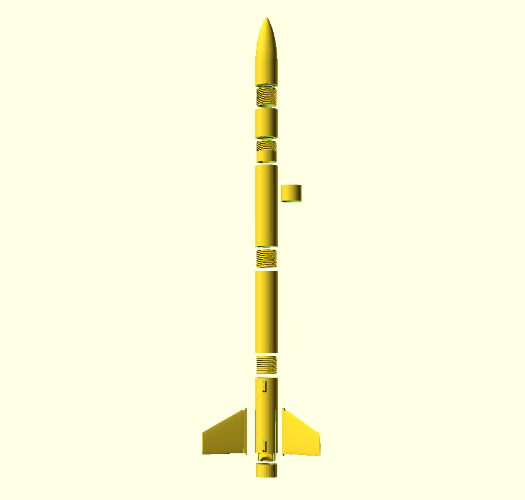

# Janus

This rocket has been designed so parts can be replaced and assembled without the use of glue (except for the main tube that requires snapping togetther shorter tubes glued with cyanoacrylate). A [blue tube](https://www.alwaysreadyrocketry.com/) is recommended to insulate the motor from the rocket motor support tube.If you use other tubes, you will need to adjust the paper_tube_wall_thickness setting accordingly.

The OpenSCAD [BOSL](https://www.openscad.org/libraries.html) library is required for threads.

[OpenRocket Model](./OpenRocket-29mm.pdf)

Other parts:
* [Kevlar shock cord](https://the-rocketman.com/kevlar-nylon-shock-cords/) or similar.
* [Kevlar cord](https://www.amazon.com/gp/product/B00OVI9XE6/) to attach shock cord to frame.
* [Blue tube (used as motor tube liner for heat insulation)](https://www.alwaysreadyrocketry.com/) or similar.
* [Parachute](https://topflightrecoveryllc.homestead.com/page1.html) - Use a [calculator](https://www.rocketreviews.com/parachute-size-calculator.html) to determine proper size.

Tested with engines:

* 29mm version:
  * Aeroetch G-80
  * Aerotech H-182R-14A and H-115  (9 seconds delay)
  
* [38mm version](./stl/38mm/):
  * Aerotech DMS I500 (12 second delay) - Altitude 4950 ft.

